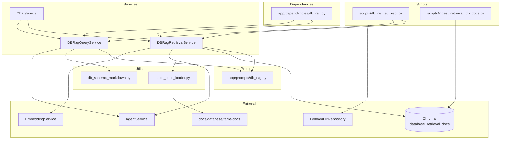
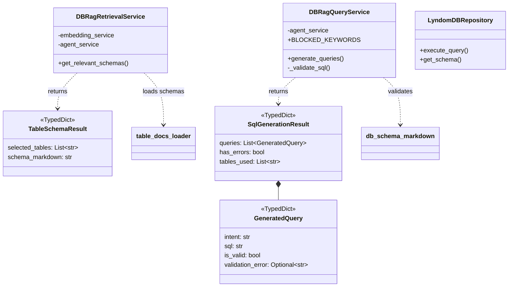
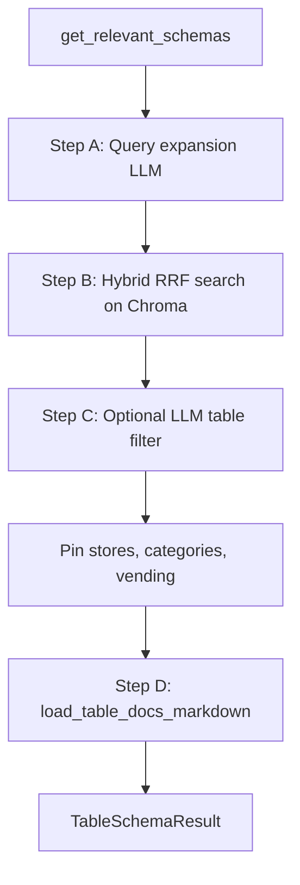
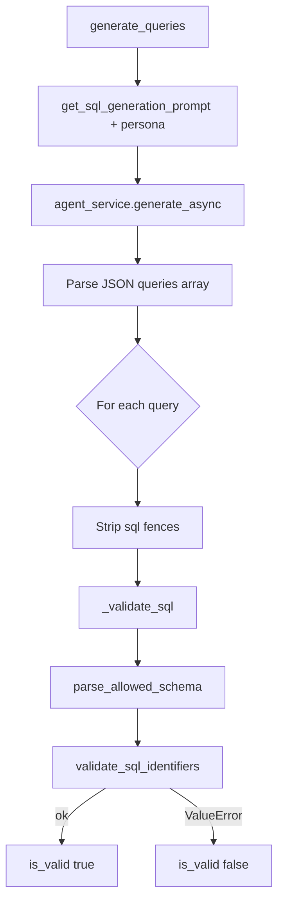
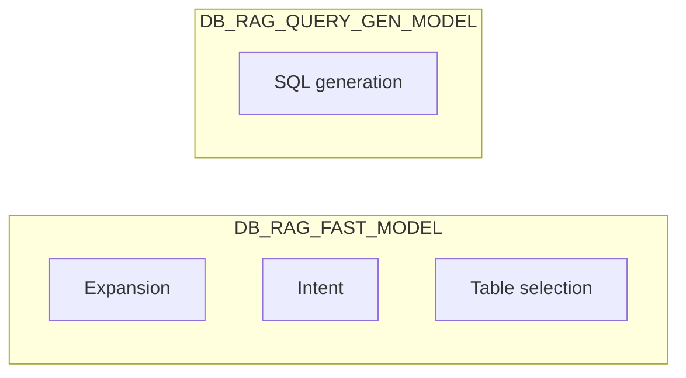
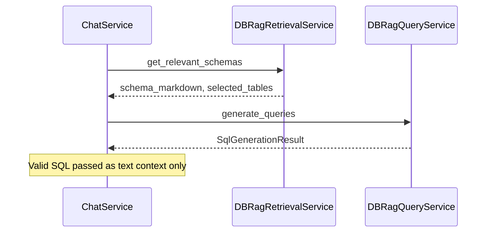
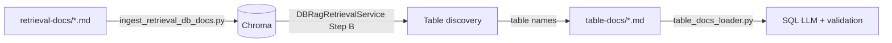

# DB-RAG Code Reference

Reference for every file, class, and function in the Database-RAG (Text-to-SQL) pipeline.

See also: [db_rag_text_to_sql_flow.md](./db_rag_text_to_sql_flow.md) for end-to-end flow and configuration.

---

## Module map

---

## Class relationship diagram

---

## `app/services/db_rag_retrieval_service.py`

**Purpose:** Find which ERP tables are relevant to a user question and assemble **full schema markdown** for the SQL generator.

### Types

| Name | Kind | Responsibility |
|------|------|----------------|
| `TableSchemaResult` | `TypedDict` | Return shape: `selected_tables` (names) + `schema_markdown` (concatenated docs). |

### Class: `DBRagRetrievalService`

| Member | Responsibility |
|--------|----------------|
| `__init__(chroma_client, embedding_service, agent_service)` | Stores `embedding_service` and `agent_service`. `chroma_client` is accepted for DI parity but collection access uses `get_collection_by_name()`. |
| `get_relevant_schemas(user_message, feature_id, use_llm_table_selection)` | **Main entry.** Runs Steps A–D below. |

#### `get_relevant_schemas` — internal steps

| Step | What happens | Prompts / deps |
|------|----------------|----------------|
| **A** | LLM rephrases user query into a technical search phrase with table anchors. Falls back to raw message on error. | `get_query_expansion_prompt`, `get_db_rag_query_expansion_persona` |
| **B** | Loads all active docs from Chroma `database_retrieval_docs`. Runs vector search (top 100) + TF-IDF lexical search. Fuses ranks with RRF (`DB_RAG_RRF_ALPHA`). Dedupes to table names, takes `DB_RAG_TOP_K`, pins `stores` if missing. Builds `retrieved_candidates` with best snippet per table. | `EmbeddingService`, `TfidfVectorizer` |
| **C** | If `DB_RAG_USE_LLM_TABLE_SELECTION`: LLM returns JSON `tables` list filtered to candidates only. Else: use all Top-K. | `get_table_selection_prompt`, `get_db_rag_table_selection_persona` |
| **Pin** | Appends `stores`, `categories`, `vending` if not already selected. | — |
| **D** | Loads first `DB_RAG_SQL_MAX_SCHEMA_TABLES` tables from **disk** `table-docs/`. On failure, falls back to Chroma retrieval-docs (no `## Columns`). | `load_table_docs_markdown` |

---

## `app/services/db_rag_query_service.py`

**Purpose:** Call the Text-to-SQL LLM and validate generated SQL before execution.

### Types

| Name | Kind | Responsibility |
|------|------|----------------|
| `GeneratedQuery` | `TypedDict` | One query: `intent` (reasoning trace), `sql`, `is_valid`, `validation_error`. |
| `SqlGenerationResult` | `TypedDict` | Batch result: `queries[]`, `has_errors`, `tables_used`. |

### Class: `DBRagQueryService`

| Member | Responsibility |
|--------|----------------|
| `BLOCKED_KEYWORDS` | Class-level set: `INSERT`, `UPDATE`, `DELETE`, `DROP`, etc. |
| `__init__(agent_service)` | Stores LLM client wrapper. |
| `generate_queries(user_message, schema_markdown, store_id, selected_tables)` | **Main entry.** Builds prompt → LLM → parse JSON → validate each SQL. |
| `_validate_sql(sql)` | **Private.** Read-only safety: no comments, no multi-statement `;`, no blocked keywords. |

#### `generate_queries` — loop per LLM query object

| Phase | Responsibility |
|-------|----------------|
| LLM call | System prompt from `get_db_rag_query_gen_persona`; user prompt from `get_sql_generation_prompt`. Expects `{"queries": [{"intent", "sql"}]}`. |
| Parse failure | Returns single invalid query with `validation_error` describing JSON error. |
| Empty SQL | Marks invalid with `"Empty SQL statement generated"`. |
| Safety | `_validate_sql` — injection / write protection. |
| Schema | `parse_allowed_schema` + `validate_sql_identifiers` — column/table whitelist. |

---

## `app/prompts/db_rag.py`

**Purpose:** All LLM instructions and user-turn templates for DB-RAG. No I/O; pure strings and persona dicts.

### System prompt constants

| Constant | Used by | Responsibility |
|----------|---------|----------------|
| `DB_RAG_INTENT_SYSTEM_PROMPT` | `get_db_rag_intent_persona` | Routes user input to DATABASE / DOCUMENTATION / BOTH. **Not wired** in current retrieval/SQL REPL path; exported for admin/routing use. |
| `DB_RAG_QUERY_EXPANSION_SYSTEM_PROMPT` | `get_db_rag_query_expansion_persona` | Minimal system role (“technical analyst”); expansion rules live in user prompt. |
| `DB_RAG_TABLE_SELECTION_SYSTEM_PROMPT` | `get_db_rag_table_selection_persona` | Pick minimal table set from candidates; header-first rule. |
| `DB_RAG_SQL_GENERATION_SYSTEM_PROMPT` | `get_db_rag_query_gen_persona` | Lyndom schema format, schema-linking workflow A–D, JSON output shape. |

### User-turn builders

| Function | Parameters | Returns | Responsibility |
|----------|------------|---------|----------------|
| `get_query_expansion_prompt` | `user_message`, `table_list` | str | Full expansion instructions + Lyndom hub hints + available tables + user question. |
| `get_db_rag_intent_prompt` | `user_message` | str | `"User Query: …"` only; system prompt holds routing rules. |
| `get_table_selection_prompt` | `user_message`, `table_summaries` | str | User question + Chroma retrieval snippets per candidate table. |
| `get_sql_generation_prompt` | `user_message`, `schemas`, `store_id?` | str | User question + store scoping + injected **table-docs** markdown + task checklist. |

### Persona factories

Each returns `{"model_name": …, "prompt_text": …}` for `SimpleNamespace` → `AgentService.generate_async`.

| Function | Model setting | System prompt |
|----------|---------------|---------------|
| `get_db_rag_query_expansion_persona` | `DB_RAG_FAST_MODEL` | `DB_RAG_QUERY_EXPANSION_SYSTEM_PROMPT` |
| `get_db_rag_intent_persona` | `DB_RAG_FAST_MODEL` | `DB_RAG_INTENT_SYSTEM_PROMPT` |
| `get_db_rag_table_selection_persona` | `DB_RAG_FAST_MODEL` | `DB_RAG_TABLE_SELECTION_SYSTEM_PROMPT` |
| `get_db_rag_query_gen_persona` | `DB_RAG_QUERY_GEN_MODEL` | `DB_RAG_SQL_GENERATION_SYSTEM_PROMPT` |

---

## `app/utils/table_docs_loader.py`

**Purpose:** Read authoritative schema files from disk (not Chroma).

| Function | Responsibility |
|----------|----------------|
| `resolve_table_docs_dir()` | Resolves `settings.DB_RAG_TABLE_DOCS_PATH` against cwd or project root (`app/` parent). |
| `load_table_docs_markdown(table_names)` | For each name, reads `{docs_dir}/{table_name}.md`. Returns `(joined markdown, list of loaded names)`. Logs warning for missing files. |

---

## `app/utils/db_schema_markdown.py`

**Purpose:** Parse table-docs markdown and validate SQL identifiers against it.

### Module-level regex

| Name | Responsibility |
|------|----------------|
| `_TABLE_HEADER` | Matches `# \`table_name\`` lines. |
| `_COLUMNS_SECTION` | Matches `## Columns` headers. |
| `_COLUMN_ROW` | Matches markdown table rows; captures column name (first cell). |
| `_SQL_KEYWORDS` | Words ignored when scanning `table.column` (e.g. `select`, `from`). |

| Function | Responsibility |
|----------|----------------|
| `parse_allowed_schema(schema_markdown)` | Builds `Dict[table_name, Set[column_name]]` from all `## Columns` tables in the markdown. |
| `_resolve_table(name, allowed)` | Case-insensitive table name lookup in parsed dict. |
| `validate_sql_identifiers(sql, allowed)` | Raises `ValueError` if `FROM`/`JOIN` table or `table.column` is not in `allowed`. No-op if `allowed` is empty. Suggests similar column names on mismatch. |

---

## `app/repositories/lyndom_db.py`

**Purpose:** Execute read-only SQL against the Lyndom PostgreSQL database.

### Class: `LyndomDBRepository`

| Method | Responsibility |
|--------|----------------|
| `__init__(db_url)` | Creates SQLAlchemy engine. |
| `get_users(limit)` | Example named query. |
| `get_clients(limit)` | Example named query. |
| `execute_query(query, params?)` | Runs SELECT/WITH only; returns `list[dict]` rows. Used by REPL after valid SQL. |
| `get_schema()` | Introspects live DB via SQLAlchemy `inspect` — **not used** by current DB-RAG path; available for future grounding. |

---

## `app/dependencies/db_rag.py`

**Purpose:** FastAPI dependency injection wiring.

| Function | Returns | Responsibility |
|----------|---------|----------------|
| `get_db_rag_retrieval_service` | `DBRagRetrievalService` | Injects Chroma, embeddings, agent. |
| `get_db_rag_query_service` | `DBRagQueryService` | Injects agent only. |

---

## `app/services/chat_service.py` (DB-RAG touchpoints)

**Purpose:** Main chat orchestration; optional DB-RAG branch inside `process_message`.

| Member / area | Responsibility |
|---------------|----------------|
| `__init__(…, db_rag_retrieval_service?, db_rag_query_service?, db_session_factory?)` | Optional DB-RAG services. |
| `process_message` Step 6 | If `DB_RAG_ENABLED`: calls `get_relevant_schemas`, then `generate_queries` with `store_id` from `Feature` record. Builds `db_rag_data` from **valid** queries only (intent + SQL text for context — does not execute SQL on DB in this path). |
| `_build_prompt(…, db_rag_data)` | Adds `## Database Results` section to the final chat prompt when SQL intents exist. |

---

## `scripts/db_rag_sql_repl.py`

**Purpose:** Interactive CLI to test retrieval → SQL → execution.

| Function | Responsibility |
|----------|----------------|
| `_print_rows(rows, max_rows)` | JSON-print result rows; respect `DB_RAG_MAX_ROWS`. |
| `_handle_query(user_query, retrieval_service, query_service, lyndom_repo, store_id)` | One query: retrieval → generation → execute valid SQL on Lyndom. |
| `main()` | Wires services, reads `DB_RAG_STORE_ID` env, REPL loop until `exit`/`quit`. |

---

## `scripts/ingest_retrieval_db_docs.py`

**Purpose:** One-time / refresh ingestion of **search** docs into Chroma.

| Function | Responsibility |
|----------|----------------|
| `ingest_retrieval_db_docs(docs_dir)` | Reads `docs/database/retrieval-docs/*.md`, embeds each file as one chunk, upserts into `database_retrieval_docs` with metadata `table_name`, `active: true`. ID = table name (deterministic). |

Does **not** ingest `table-docs/` — those stay on disk for SQL generation.

---

## `app/config/setting.py` (DB-RAG settings)

| Setting | Default | Used by |
|---------|---------|---------|
| `DB_RAG_ENABLED` | `true` | `ChatService` |
| `DB_RAG_FAST_MODEL` | `gpt-5.4-nano` | Expansion, intent, table selection personas |
| `DB_RAG_QUERY_GEN_MODEL` | `gpt-5.4-mini` | SQL generation persona |
| `DB_RAG_TABLE_DOCS_PATH` | `docs/database/table-docs` | `table_docs_loader` |
| `DB_RAG_TOP_K` | `20` | Retrieval hybrid search cap |
| `DB_RAG_SQL_MAX_SCHEMA_TABLES` | `22` | Max full table-docs loaded into SQL prompt |
| `DB_RAG_RRF_ALPHA` | `0.5` | Vector vs lexical weight in RRF |
| `DB_RAG_SIMILARITY_THRESHOLD` | `0.25` | (reserved / other RAG paths) |
| `DB_RAG_MAX_ROWS` | `200` | REPL output cap |
| `DB_RAG_USE_LLM_TABLE_SELECTION` | `false` | Step C in retrieval |
| `LYNDOM_SQL_TIMEOUT_MS` | `15000` | `LyndomDBRepository` — Postgres `statement_timeout` on every Lyndom connection; a cancelled query surfaces as that query's `execution_error` |

---

## Data directories

| Directory | Consumed by | Contains |
|-----------|-------------|----------|
| `docs/database/retrieval-docs/` | Chroma ingestion, hybrid search | Purpose, when to retrieve, co-retrieved tables |
| `docs/database/table-docs/` | `load_table_docs_markdown` | Full `## Columns`, FKs, SQL-critical notes |

---

## Quick lookup: “who does what?”

| Concern | File / symbol |
|---------|----------------|
| Find relevant tables | `DBRagRetrievalService.get_relevant_schemas` |
| Load column definitions | `load_table_docs_markdown` |
| Generate SQL | `DBRagQueryService.generate_queries` |
| Block writes / injection | `DBRagQueryService._validate_sql` |
| Block bad column names | `validate_sql_identifiers` |
| LLM instructions | `app/prompts/db_rag.py` |
| Run SQL on DB | `LyndomDBRepository.execute_query` (REPL only today) |
| Populate Chroma | `ingest_retrieval_db_docs` |
| Wire into API | `app/dependencies/db_rag.py` + `ChatService` |
