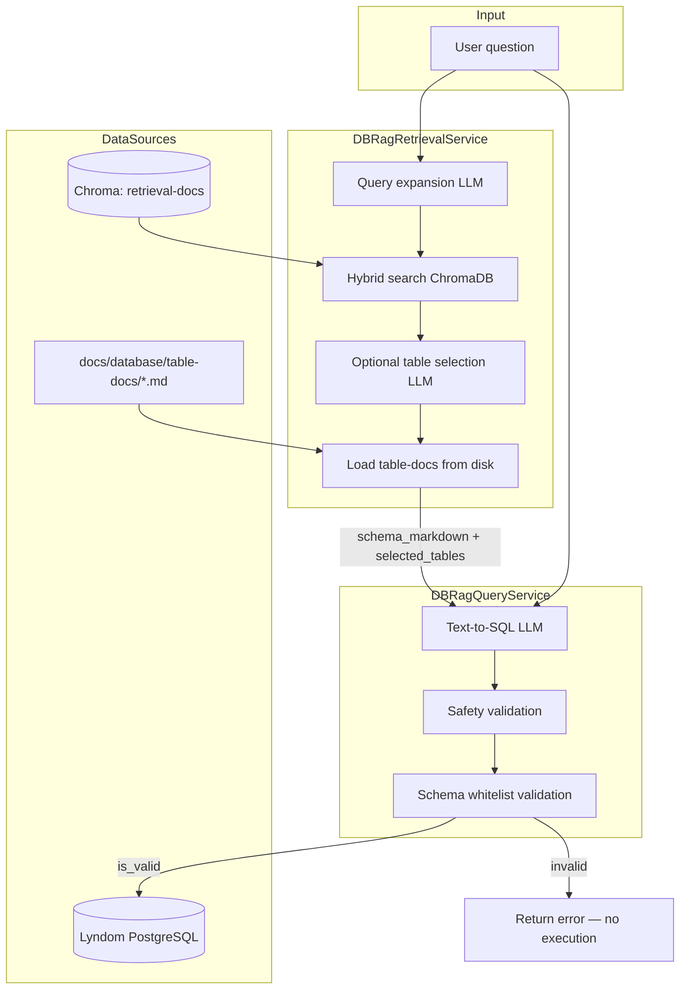
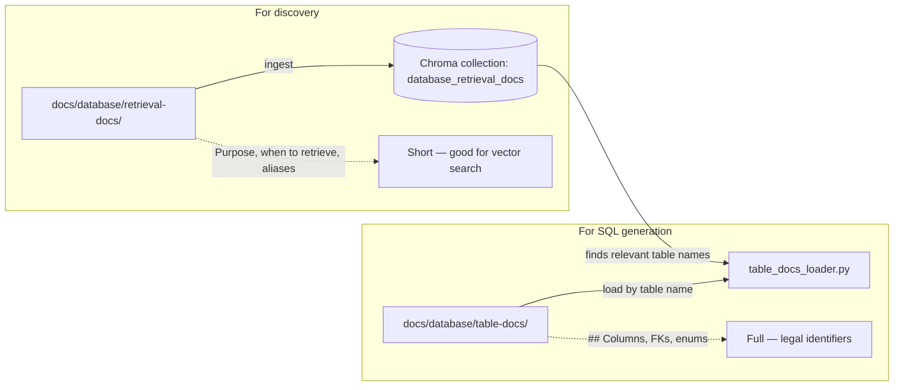
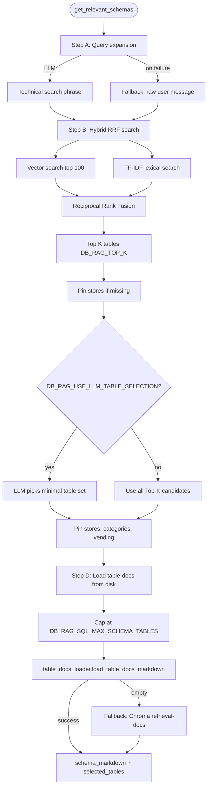
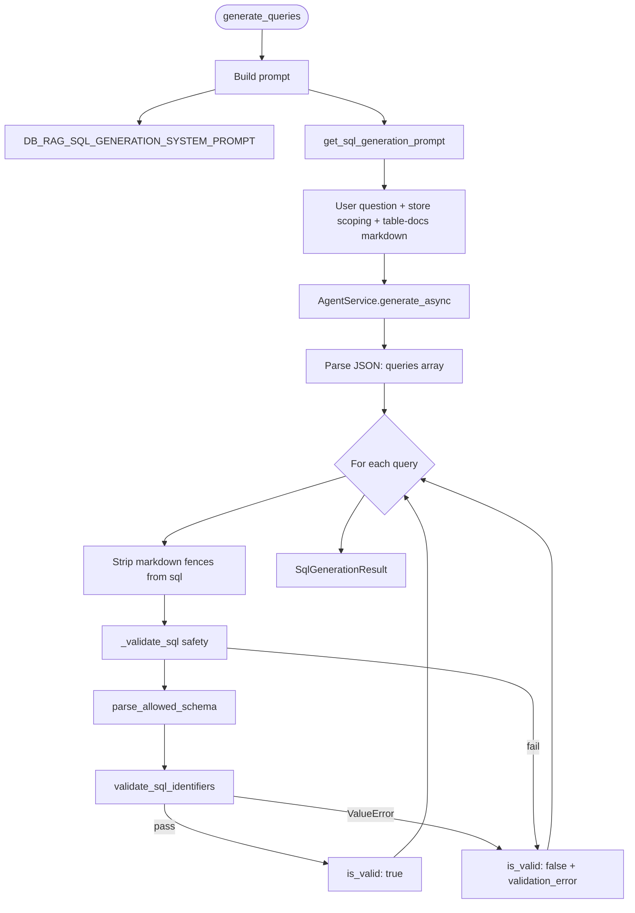
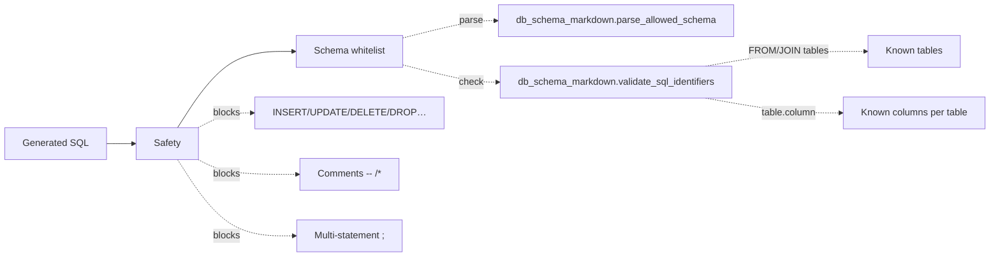
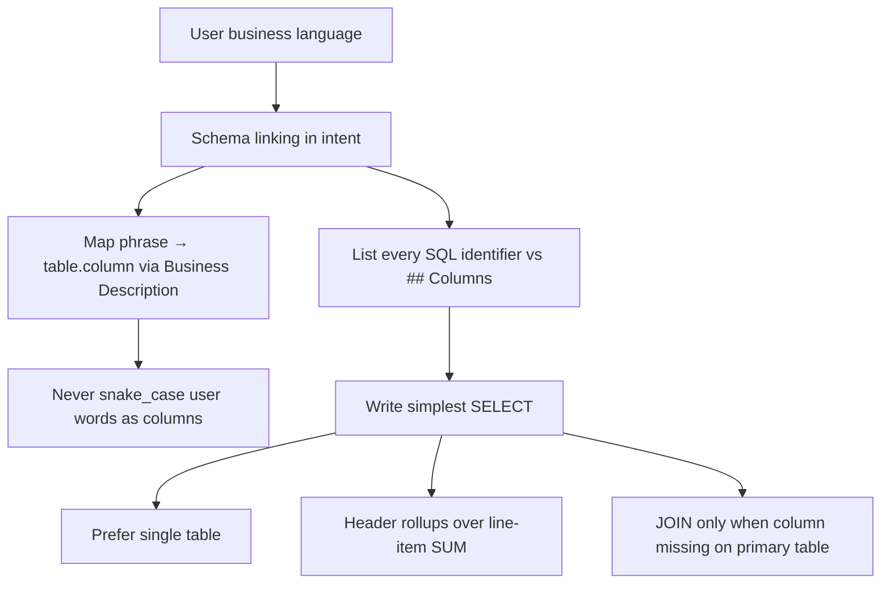
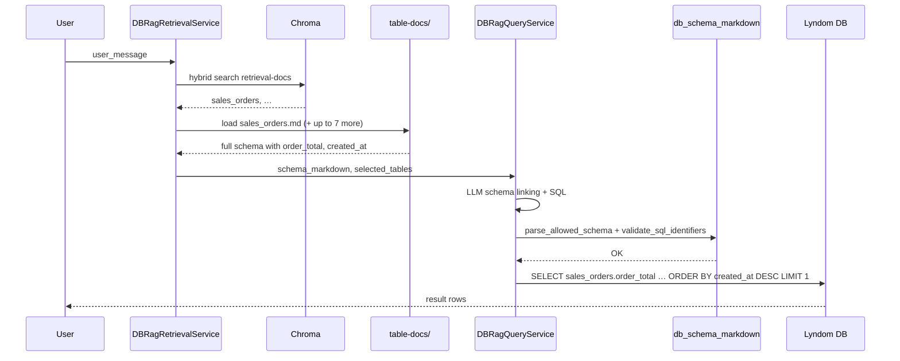
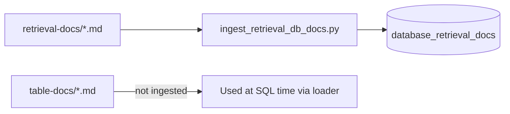

# DB-RAG Text-to-SQL Flow

How natural-language questions become validated PostgreSQL queries against the Lyndom ERP database.

See also: [db_rag_reference.md](./db_rag_reference.md) for per-file, class, and method documentation.

---

## High-level flow

---

## Documentation split (why two folders)

| Path | Role | Used in pipeline |
|------|------|------------------|
| `retrieval-docs/` | Semantic search: which tables matter | Chroma hybrid search (Step B) |
| `table-docs/` | Authoritative schema for SQL | Disk load after table selection (Step D) |

**Important:** Chroma snippets do **not** include `## Columns`. SQL must use disk `table-docs`, or the model has no real column names to follow.

---

## Retrieval detail (`DBRagRetrievalService`)

### Step notes

| Step | Component | Output |
|------|-----------|--------|
| **A** | `get_query_expansion_prompt` + fast model | Richer search query with table name anchors |
| **B** | Embeddings + TF-IDF + RRF (`DB_RAG_RRF_ALPHA`) | Ordered list of candidate table names |
| **C** | Optional `get_table_selection_prompt` | Smaller table set (header-first rule in prompt) |
| **D** | `load_table_docs_markdown` | Full markdown with `## Columns` for SQL LLM |

---

## SQL generation detail (`DBRagQueryService`)

### Validation layers

| Layer | File | What it catches |
|-------|------|-----------------|
| Safety | `db_rag_query_service._validate_sql` | Writes, injection patterns, multiple statements |
| Schema | `db_schema_markdown.py` | Hallucinated tables/columns (e.g. `grand_total`) |

If `parse_allowed_schema` returns nothing (no `## Columns` in context), schema validation is **skipped** with a warning — queries may still run but are not grounded.

---

## Text-to-SQL LLM behavior (prompts)

Prompts live in `app/prompts/db_rag.py`:
- **System:** Lyndom doc format, workflow steps A–D, output JSON shape
- **User:** Question, store scoping, injected `table-docs` markdown

---

## End-to-end example

**Question:** `get total amount of last sales order`

---

## Configuration

| Setting | Default | Effect |
|---------|---------|--------|
| `DB_RAG_TABLE_DOCS_PATH` | `docs/database/table-docs` | Disk path for full schemas |
| `DB_RAG_TOP_K` | `20` | Max tables from hybrid search |
| `DB_RAG_SQL_MAX_SCHEMA_TABLES` | `22` | Max full table-docs loaded into SQL prompt |
| `DB_RAG_USE_LLM_TABLE_SELECTION` | `false` | LLM filters candidate tables |
| `DB_RAG_RRF_ALPHA` | `0.5` | Vector vs lexical weight in fusion |
| `DB_RAG_QUERY_GEN_MODEL` | (env) | Stronger model for SQL step |
| `DB_RAG_FAST_MODEL` | (env) | Expansion / table selection |

---

## Key files

| File | Responsibility |
|------|----------------|
| `app/services/db_rag_retrieval_service.py` | Search + table selection + load table-docs |
| `app/services/db_rag_query_service.py` | LLM SQL generation + validation |
| `app/prompts/db_rag.py` | All DB-RAG prompts |
| `app/utils/table_docs_loader.py` | Read `{table}.md` from disk |
| `app/utils/db_schema_markdown.py` | Parse columns + validate SQL identifiers |
| `scripts/db_rag_sql_repl.py` | Local REPL: retrieval → SQL → execute |
| `scripts/ingest_retrieval_db_docs.py` | Ingest `retrieval-docs/` into Chroma |

---

## Chat integration

In production (`ChatService`), the same pipeline runs when `DB_RAG_ENABLED` is true: valid SQL intents are passed into the chat context; execution path depends on how the feature wires `LyndomDBRepository` (REPL executes directly).

---

## Ingestion (one-time / refresh)

Re-run ingestion when `retrieval-docs` change. Update `table-docs` on disk when the physical schema changes — no Chroma re-index required for SQL column accuracy.
