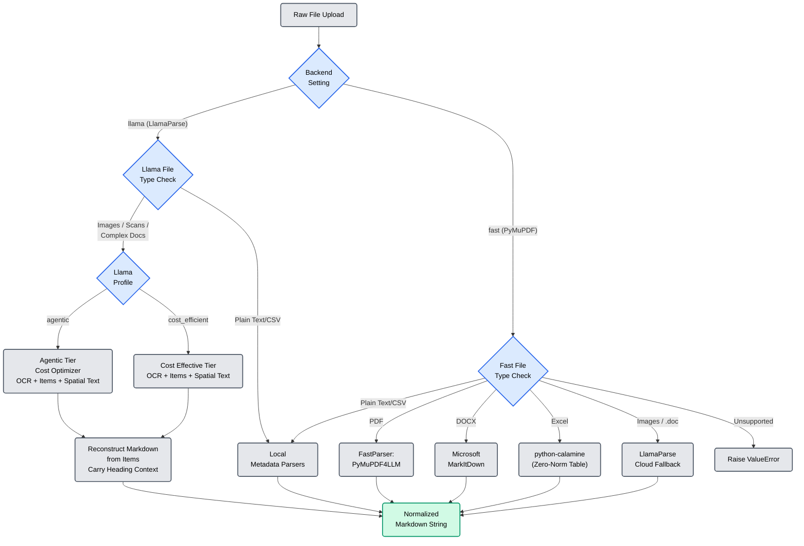
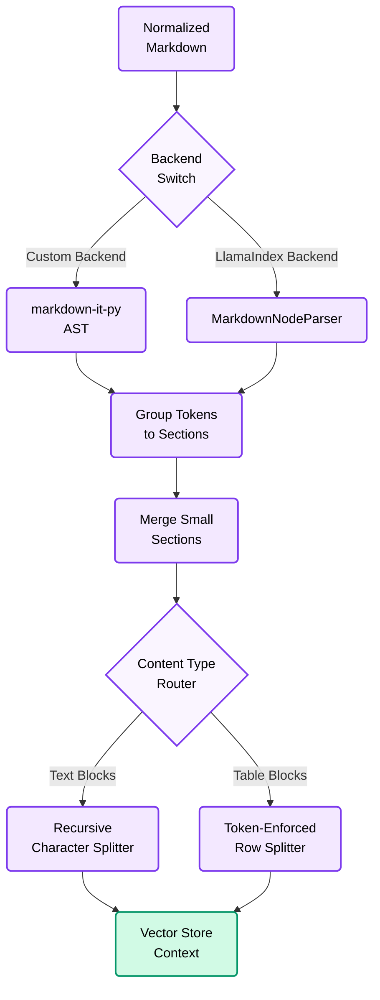
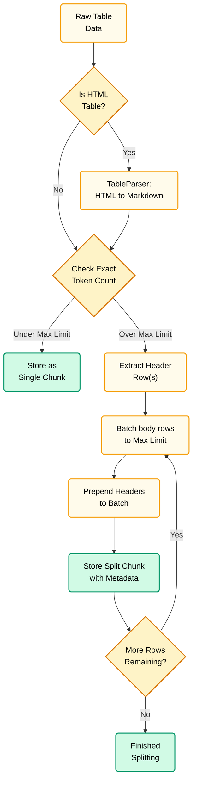

# Document Parsing and Chunking Architecture

This document provides a comprehensive overview of the Retrieval-Augmented Generation (RAG) system's ingestion pipeline. It details the logical flow of document processing and chunking, followed by a code-level analysis of the underlying components.

---

## Part 1: Logical Architecture & Flow

The ingestion pipeline transforms raw, multi-modal files into semantically meaningful, vector-ready text chunks. It handles this in two configurable phases: **Parsing** and **Chunking**.

### 1.1 The Parsing Flow

The parsing phase routes file types to the appropriate processor based on the `DOCUMENT_PARSER_BACKEND` setting.

### 1.2 Parsing Backends Comparison

| Feature | `llama` (LlamaParse) | `fast` (Local / Extended) |
| :--- | :--- | :--- |
| **Strategy** | Cloud-based Multimodal / OCR | Local Extractors + Cloud Fallback |
| **Performance** | Slower (Network + AI Inference) | **Extremely Fast** (Local CPU) |
| **Cost** | API Usage Costs | **Free** (Except for fallback routes) |
| **PDF Support** | Complex Layouts, Scans, Hand-writing | Native Text-based PDFs only |
| **Image Support** | Full (OCR / Vision) | Yes (Routes to LlamaParse fallback via API Key) |
| **Format Support** | PDF, DOCX, XLSX, PPTX, PNG, JPG, etc. | PDF, DOCX, XLS(X), CSV, TXT, MD. (Images & .doc via fallback) |
| **Best For** | High-fidelity extraction of complex UI/Scans | Massive batches of clean text PDFs |
| **Page Metadata** | Preserved through `<!-- PAGE:N -->` markers in reconstructed Markdown | Preserved through normalized `<!-- PAGE:N -->` markers |

---

### 1.3 The Chunking Flow & Backends

Once the document is parsed into a unified Markdown string, it is sent to the chunker. The system supports two **Chunker Backends**, configurable via `MARKDOWN_CHUNKER_BACKEND`:

1. **Custom Backend (`MarkdownChunker`)**: Uses an internal AST parser (`markdown-it-py`).
2. **LlamaIndex Backend (`LlamaIndexMarkdownChunker`)**: Leverages LlamaIndex's native `MarkdownNodeParser` and `MarkdownElementNodeParser`.

### 1.4 Table Splitting Strategy

A specialized mechanism gracefully handles massive HTML/Markdown tables, avoiding loss of column context. This logic applies symmetrically to both chunking backends.

---

## Part 2: Code-Level Documentation

### 2.1 Llama Parsing System (`document_parser.py`)

The `DocumentParser` normalizes diverse file formats using the LlamaParse v2 HTTP API. For cloud-parsed documents and images, it requests three views from LlamaParse:

- `markdown`: the parser's default Markdown output.
- `items`: the structured layout tree containing headings, text blocks, tables, and figures.
- `text`: spatial text, requested with layout-preservation options for debugging and future fallback use.

The production return value is Markdown reconstructed from `items`. This is intentional: the reconstructed Markdown keeps normal `<!-- PAGE:N -->` page markers and inserts `<!-- CONTINUED_CONTEXT: ... -->` comments at page transitions so downstream chunking retains the active heading hierarchy.

#### The `LLAMA_PARSE_CONFIG_PROFILE`
The system supports exactly two LlamaParse profiles, configurable via `LLAMA_PARSE_CONFIG_PROFILE`:

1. **`cost_efficient` (Default when `DOCUMENT_PARSER_BACKEND=llama`)**
   - Uses LlamaParse v2 `tier="cost_effective"`.
   - Uses the same OCR, table, item, and spatial-text output settings as `agentic`.
   - Does not enable cost optimizer because this profile is already the economical tier.

2. **`agentic`**
   - Uses LlamaParse v2 `tier="agentic"`.
   - Enables `processing_options.cost_optimizer.enable=true`, allowing simple pages to route to the cheaper tier while complex pages remain agentic.
   - Enables OCR language configuration through `processing_options.ocr_parameters.languages`.
   - Requests table merging, inline images, link annotation, `items`, and spatial text.

Both profiles share the same structure-preserving output contract:

- `expand=markdown,items,text`
- `output_options.markdown.tables.merge_continued_tables=true`
- `output_options.markdown.tables.output_tables_as_markdown=false`
- `output_options.spatial_text.preserve_layout_alignment_across_pages=true`
- `output_options.spatial_text.preserve_very_small_text=true`
- `output_options.spatial_text.do_not_unroll_columns=true`

The old `custom` profile and custom/vendor multimodal prompt path are no longer supported in production. Use `cost_efficient` for the cheaper LlamaParse path.

#### Metadata Contract
The parser still returns a Markdown string to the rest of the ingestion pipeline. Page metadata is preserved the same way as before: chunkers read `<!-- PAGE:N -->` markers and write `page` metadata onto chunks. The reconstructed Markdown adds hierarchy continuity comments, but raw LlamaParse response metadata such as confidence, printed page number, job metadata, and cost-optimized page flags is not stored unless a future structured parse-result flow is added.

---

### 2.2 Fast Parsing System (`fast_document_parser.py`)

The `FastDocumentParser` provides a local, high-performance alternative to cloud parsing, heavily optimized for standard enterprise documents.

#### Core Local Engines
- **PDF Extraction:** Uses `pymupdf4llm` with heuristics like `FONTSIZE_LIMIT` (drops <3pt text to kill watermarks) and background color detection to ignore vector noise.
- **Word Extraction (.docx):** Uses Microsoft's `MarkItDown` library to natively preserve semantic hierarchy (headings, bold/italics), lists, and embedded pipe tables.
- **Excel Extraction (.xls, .xlsx, etc.):** Uses `python-calamine` to extract massive spreadsheets into Markdown tables. It is intentionally chosen to provide zero-normalization pass-through (ignoring Pandas' aggressive type-casting) and automatically sanitizes cell contents to ensure Markdown pipe syntax isn't broken.

#### The LlamaParse Cloud Fallback
If a user uploads an image (`png`, `jpg`, `webp`) or a legacy Word file (`.doc`) while using the fast parser, it seamlessly injects the document into a `LlamaParse` backend router. If an API key is provided, the file is parsed without throwing an error; if not, an enterprise-safe validation error is raised without exposing backend configuration.

#### The Normalization Contract
To ensure the output is compatible with the `MarkdownChunker` system, the fast parser implements `_normalize_page_separators`. This converts internal PyMuPDF markers into the project-standard `<!-- PAGE:N -->` format.

---

### 2.3 Chunking System: Swappable Backends

The system introduces dynamic swappability for its chunking backend. Depending on the `MARKDOWN_CHUNKER_BACKEND` setting (`custom` vs `llamaindex`), one of two classes is instantiated via `documents.py`.

#### Option A: `MarkdownChunker` (`markdown_chunker.py`)
- **Engine:** `markdown-it-py`.
- **AST Logic:** Generates raw syntactic tokens representing blockquotes, paragraphs, tables, and lists. 
- **Grouping:** Manually tracks headers `#` to construct a header path (e.g. `["Introduction", "Features"]`), accumulating raw syntax tokens into `Section` objects.

#### Option B: `LlamaIndexMarkdownChunker` (`llamaindex_chunker.py`)
- **Engine:** LlamaIndex's `MarkdownNodeParser` and `MarkdownElementNodeParser`.
- **AST Logic:** Instantiates LlamaIndex `TextNode` objects instead of raw strings. 
- **Grouping:** Traverses the LlamaIndex AST object relationships. For example, it extracts headings natively managed by LlamaIndex's `get_nodes_from_documents`, reducing manual AST traversal overhead and increasing integration safety with the LlamaIndex ecosystem.
- **Node Parsing:** Contains a custom subclass `_NoSummaryMarkdownElementNodeParser` to bypass LlamaIndex's default behavior of using an LLM to blindly summarize table blocks, allowing our system to maintain predictable execution costs.

#### Shared Advanced Table Splitting Logic
Regardless of which backend is active, both utilize a shared algorithm for breaking up tables (`_chunk_table`). 
1. If a table exceeds `TABLE_MAX_TOKENS`, it slices the table body horizontally.
2. It prepends the exact table headers to every sliced chunk. 
3. The metadata injects specific bounding indicators (`row_start`, `row_end`, `overflow=true`), maintaining complete mathematical and structural fidelity when embedded into `ChromaDB`.

---

### 2.4 Local Table Parsing (`table_parser.py`)

When any parser retrieves tables as HTML, `TableParser.html_to_markdown` ensures conversion is clean. 
- Uses `BeautifulSoup4`.
- Prevents line breaks inside table cells (`\n`) from breaking the Markdown pipe table rendering.
- Safely encodes literal `|` characters within cell text as `\|`.

