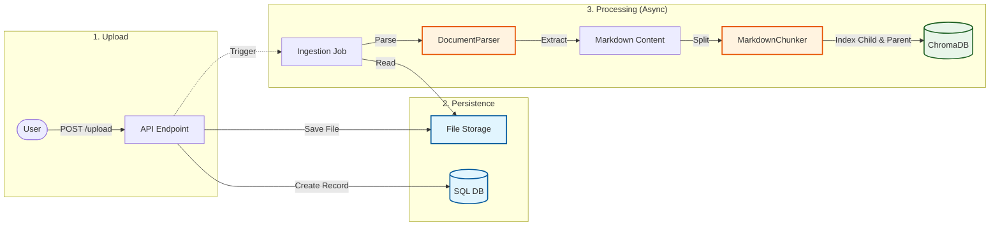
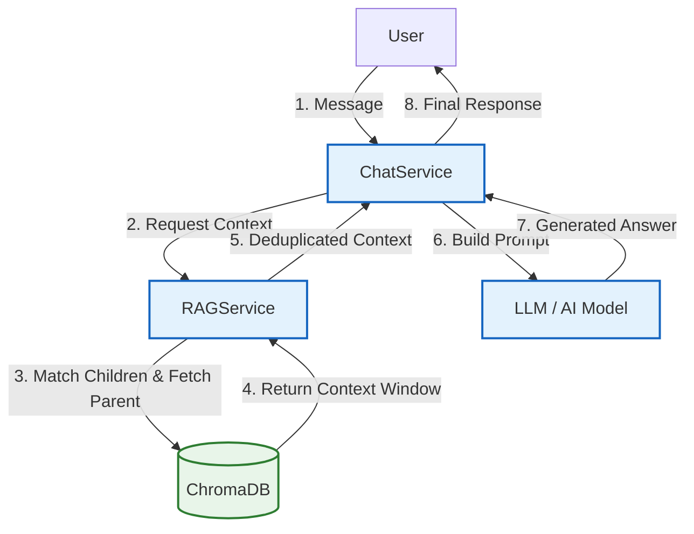

# RAG System Architecture & Guide

This document outlines the architecture, data flow, and configuration of the Retrieval-Augmented Generation (RAG) pipeline.

## Core Concepts

* **Feature:** A logical product area (e.g., "HR", "Sales") containing its own document collection and persona.
* **Classroom:** A standalone grouping that can be assigned to one or more features (M:N).
* **ClassroomItem:** A standalone, reusable unit (keyed by an external `inventory_item_id`) that can be assigned to one or more classrooms (M:N). Each item owns its own vector collection, `item_{ClassroomItem.id}`.
* **File:** The raw uploaded asset (PDF, CSV, etc.) stored on disk.
* **Document:** The processed record in the system corresponding to a File.
* **Chunk:** A discrete segment of text or a dataset (table) indexed in the vector database.
* **Persona:** The system prompt and model configuration used by the LLM for a specific Feature.

---

## Data Ingestion Pipeline

The ingestion process transforms raw files into searchable vectors. This happens asynchronously to handle large files efficiently.

### 1. Parsing Strategy

We use a hybrid approach to handle various file types:

* **Complex Documents (PDF, DOCX, Images):** Processed via **LlamaParse** when `DOCUMENT_PARSER_BACKEND=llama`.
  * *Modes:* `LLAMA_PARSE_CONFIG_PROFILE=agentic` uses the Agentic tier with cost optimizer; `LLAMA_PARSE_CONFIG_PROFILE=cost_efficient` uses the Cost Effective tier.
  * *Output:* Requests `markdown`, `items`, and spatial `text`, then reconstructs final Markdown from `items`.
  * *Structure:* Keeps `<!-- PAGE:N -->` markers and adds `<!-- CONTINUED_CONTEXT: ... -->` at page transitions so headers and hierarchy survive chunking.
  * *Tables:* Requests merged continued tables and HTML table output, then converts HTML tables to Markdown pipe tables using our custom `TableParser`.
* **Spreadsheets (CSV, XLS):** Converted directly to Markdown tables.
* **Text/Markdown:** Processed using **AST-based parsing** (`markdown-it-py`). This is superior to regex as it accurately understands document structure (nested lists, code blocks, quote blocks) rather than just pattern matching.

### 2. Chunking Logic (`MarkdownChunker`)

Content is processed using a **hybrid approach** combining structural analysis and token usage:

* **Structural Parsing:** First, content is split by Markdown syntax (headers, lists, tables).
* **Recursive Token Splitting:** Text blocks within those structures are further split using `RecursiveCharacterTextSplitter`. This ensures that large sections are broken down into token-sized chunks (default 500 tokens) while respecting sentence boundaries.
* **Structural Parsing:** First, content is split by Markdown syntax (headers, lists, tables).
* **Recursive Token Splitting:** Text blocks within those structures are further split using `RecursiveCharacterTextSplitter`. This ensures that large sections are broken down into token-sized chunks (default 500 tokens) while respecting sentence boundaries.
* **Tables:**
  * Preserved as whole units where possible.
  * Large tables are split by row ranges (`row_start`, `row_end`) to fit token limits.
  * **Header Preservation:** When a table is too large and must be split across chunks, the **header rows are repeated** in each chunk. This ensures the LLM always understands the column context for every row.
  * **Metadata Safety:** Large table HTML metadata is truncated (>25k chars) to prevent database bloat.
* **Context Breadcrumbs:** Every chunk retains its hierarchical path (e.g., `Input Format / JSON Structure / Examples`). This provides critical context to the LLM even if the chunk itself is isolated.
* **Metadata Sanitization:** User-provided metadata is strictly filtered against a `RESERVED_KEYS` allow-list to prevent overwriting critical system fields like `chunk_index` or `table_id`.
* **[Planned] Parent-Child Indexing:** Future implementation will create a hierarchy where small "child" chunks (for precise vector search) are linked to larger "parent" chunks. This allows fetching diverse parents based on specific child matches.

---

## Retrieval & Generation Flow

How the system answers user questions using indexed data.

### Retrieval Strategy

* **Collections queried per request:** `feature_{feature_id}` (the feature's own direct uploads) plus one `item_{item_id}` per classroom-item reachable from the feature (feature → classrooms → items). Item IDs are deduplicated when the same item appears in multiple assigned classrooms.
* **Current:** Standard top-k vector similarity search across the resolved collection list with **active document filtering**. Only chunks with `active: "true"` metadata are returned. Hits from all collections are globally re-ranked by distance before the similarity threshold is applied.
* **[Planned] Parent Window Retrieval:** Instead of returning only the matched chunk, the system will fetch the linked **parent chunk** (or surrounding context window) to provide the LLM with complete, coherent information.

### Document Active Status

Every chunk stored in ChromaDB carries an `active` metadata field:

* **On ingestion:** All new chunks are created with `active: "true"` by default (set in `_build_base_metadata`).
* **On retrieval:** The RAG query includes `where={"active": "true"}` to exclude deactivated documents.
* **On reprocess:** The active status is preserved from the old chunks.
* **Toggling:** `DocumentService.activate_document()` / `deactivate_document()` update all chunks for a document.
* **Protection:** `active` is a reserved metadata key — it cannot be set or overridden through the general metadata update endpoint.

---

## Configuration Reference

### Storage & Limits

| Environment Variable | Description |
| :--- | :--- |
| `FILE_STORAGE_PATH` | Local directory for uploaded files. |
| `VECTOR_STORE_PATH` | Local directory for ChromaDB persistence. |
| `ALLOWED_FILE_TYPES` | JSON list or comma-separated extensions (e.g., `[.pdf,.docx]`). |
| `MAX_FILE_SIZE_MB` | Maximum file size allowed for upload. |

### Parsing (LlamaParse)

| Key | Default | Notes |
| :--- | :--- | :--- |
| `LLAMA_PARSE_API_KEY` | - | Required for PDF/Image parsing. |
| `LLAMA_PARSE_LANGUAGE` | `en` | OCR language passed to `processing_options.ocr_parameters.languages`. |
| `LLAMA_PARSE_CONFIG_PROFILE` | `cost_efficient` | Supported values: `cost_efficient` and `agentic`. `cost_effective` / `cost-effective` aliases normalize to `cost_efficient`. |
| `LLAMA_PARSE_VERSION` | `latest` | LlamaParse v2 tier version. Pin a dated version for reproducible production output. |
| `DOCUMENT_PARSER_BACKEND` | `fast` | Set to `llama` to use LlamaParse cloud parsing. |

The LlamaParse output options are intentionally code-owned in `LlamaParseConstants`, not exposed as separate environment variables. Both profiles request `expand=markdown,items,text`, merge continued tables, preserve spatial alignment across pages, preserve very small text, and avoid unrolling columns. The final Markdown is reconstructed from `items` before chunking.

### Embeddings

| Variable | Default | Role |
| :--- | :--- | :--- |
| `EMBEDDING_PROVIDER` | - | Required. Changing provider/model requires reindexing existing Chroma collections. |
| `EMBEDDING_MODEL_NAME` | - | Optional provider-specific model name. |
| `EMBEDDING_BATCH_SIZE` | `64` | Batch size for embedding calls. |

### Chunking Settings

| Variable | Default | Role |
| :--- | :--- | :--- |
| `TEXT_CHUNK_SIZE` | `500` | Target token count for text chunks. |
| `TEXT_CHUNK_OVERLAP` | `100` | Tokens shared between adjacent chunks (context continuity). |
| `TABLE_MAX_TOKENS` | `1000` | Max tokens per table chunk before splitting. |
| `TABLE_MAX_ROWS` | `50` | Max rows per table chunk (soft limit). |

---

## Code Map

| Component | File Path | Role |
| :--- | :--- | :--- |
| **Parsing Logic** | `app/utils/document_parser.py` | Extracts text/tables from files. |
| **Table Utils** | `app/utils/table_parser.py` | Converts HTML tables to Markdown. |
| **Chunking** | `app/utils/markdown_chunker.py` | Splits text into token-sized blocks. |
| **Vector Indexing** | `app/services/documents.py` | Embeds chunks via EmbeddingService and stores them in ChromaDB. |
| **Retrieval** | `app/services/rag_service.py` | Searches ChromaDB for active documents. |
| **Orchestration** | `app/services/chat_service.py` | Manages the chat flow. |
| **File Management** | `app/services/files.py` | Handles file uploads & storage. |
| **LLM Interaction** | `app/services/agent_service.py` | Sends prompts to the AI model. |
