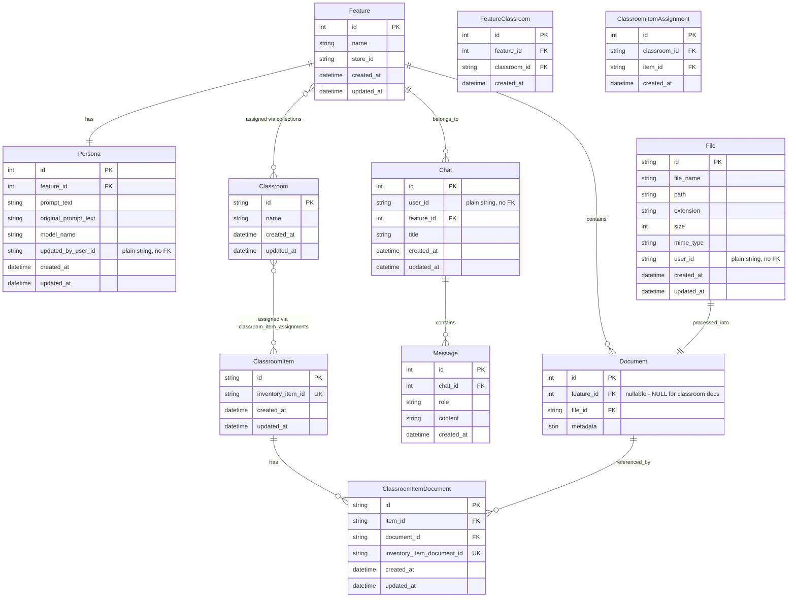
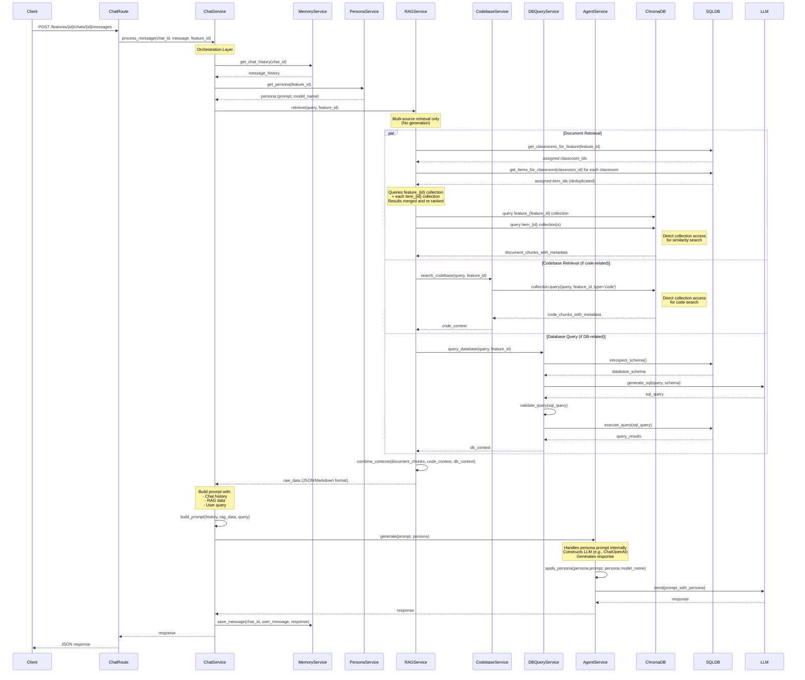
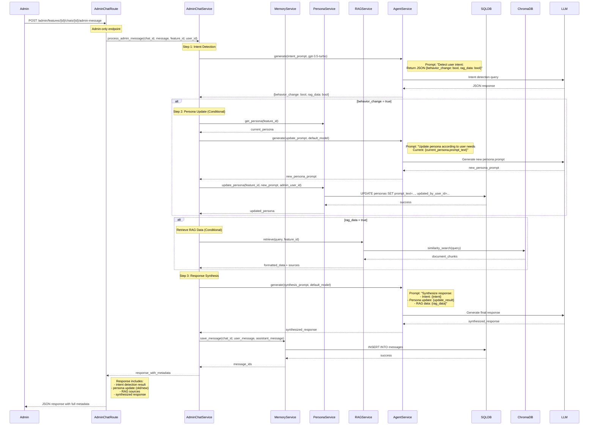
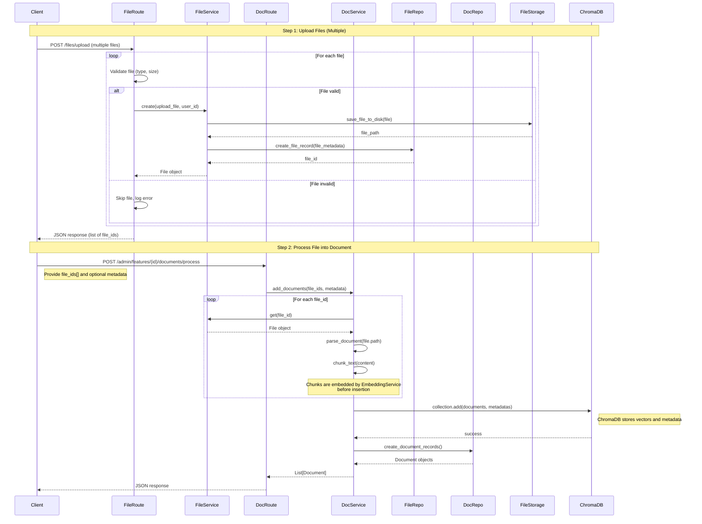
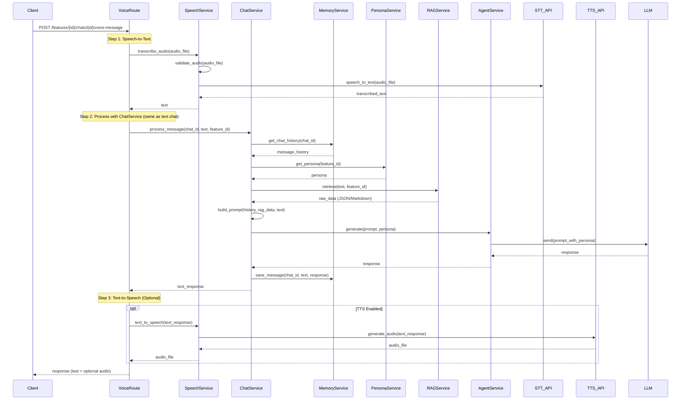
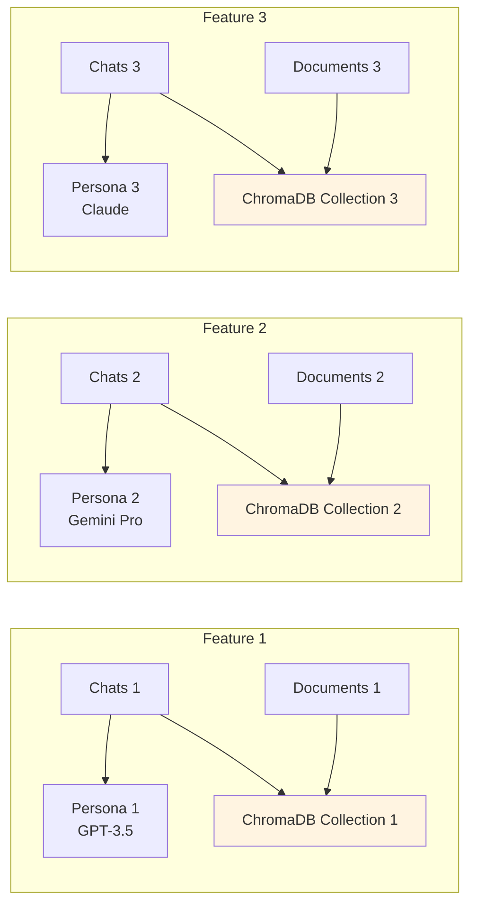
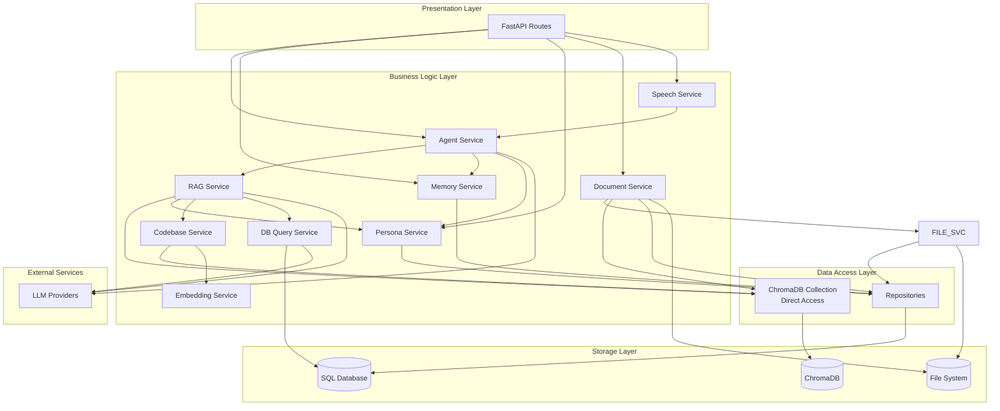
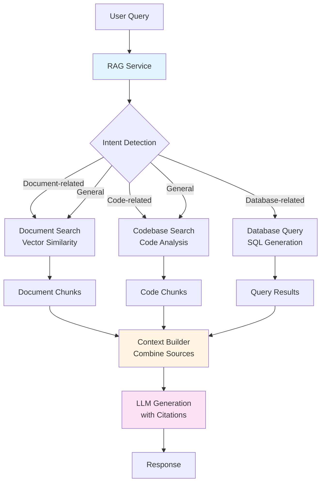

# System Architecture Diagram

This document provides visual representations of the AI Agent system architecture.

Standard user chat and voice endpoints use **`ChatAgentService`** with the OpenAI Agents SDK for OpenAI-qualified persona models, and fall back to **`ChatService`** (LangChain) for other providers. See [chat-agent-sdk.md](chat-agent-sdk.md).

## High-Level System Architecture

```mermaid
graph TB
    subgraph "Client Layer"
        WEB[Web Client]
        MOBILE[Mobile Client]
        API_CLIENT[API Client]
    end

    subgraph "API Layer"
        FILE_ROUTE[File Routes<br/>/files/*]
        CHAT_ROUTE[Chat Routes<br/>/features/*/chats/*]
        ADMIN_CHAT_ROUTE[Admin Chat Routes<br/>/admin/features/*/chats/*/admin-message]
        DOC_ROUTE[Document Routes<br/>/admin/features/*/documents/*]
        PERSONA_ROUTE[Persona Routes<br/>/admin/features/*/personas]
        VOICE_ROUTE[Voice Routes<br/>/features/*/chats/*/voice-message]
        FEATURE_ROUTE[Feature Routes<br/>/admin/features/*]
        CLASSROOM_ROUTE[Classroom Routes<br/>/admin/classrooms/*]
    end

    subgraph "Service Layer"
        FEATURE_SVC[Feature Service<br/>Feature Management]
        CLASSROOM_SVC[Classroom Service<br/>Classroom Management]
        CHAT_SVC[Chat Service<br/>Standard Chat Flow]
        ADMIN_CHAT_SVC[Admin Chat Service<br/>Multi-Agent Orchestration]
        AGENT_SVC[Agent Service<br/>LangChain Integration]
        RAG_SVC[RAG Service<br/>Retrieval Augmented Generation]
        MEMORY_SVC[Memory Service<br/>Chat History]
        PERSONA_SVC[Persona Service<br/>LLM Selection & Updates]
        FILE_SVC[File Service<br/>File Upload & Storage]
        DOC_SVC[Document Service<br/>Parsing & Chunking]
        EMBED_SVC[Embedding Service<br/>Text Embeddings]
        SPEECH_SVC[Speech Service<br/>STT/TTS]
        CODEBASE_SVC[Codebase Service<br/>Code Analysis]
        DB_QUERY_SVC[DB Query Service<br/>SQL Generation]
    end

    subgraph "Repository Layer"
        CHAT_REPO[Chat Repository]
        MSG_REPO[Message Repository]
        FEATURE_REPO[Feature Repository]
        PERSONA_REPO[Persona Repository]
        DOC_REPO[Document Repository]
        FILE_REPO[File Repository]
        CLASSROOM_REPO[Classroom Repository]
        CLASSROOM_ITEM_REPO[ClassroomItem Repository]
        CLASSROOM_ITEM_ASSIGN_REPO[ClassroomItemAssignment Repository]
        CLASSROOM_ITEM_DOC_REPO[ClassroomItemDoc Repository]
    end

    subgraph "Data Layer"
        SQL_DB[(PostgreSQL/SQLite<br/>Relational Database)]
        VECTOR_DB[(ChromaDB<br/>Vector Database)]
        FILE_STORAGE[(File Storage<br/>storage/documents/)]
    end

    subgraph "External Services"
        LLM[LLM Providers<br/>OpenAI/Anthropic/Gemini]
        EMBED_API[Embedding API<br/>OpenAI/HuggingFace]
        STT_API[Speech-to-Text API<br/>OpenAI Whisper]
        TTS_API[Text-to-Speech API<br/>OpenAI TTS]
    end

    WEB --> FILE_ROUTE
    WEB --> CHAT_ROUTE
    WEB --> DOC_ROUTE
    WEB --> FEATURE_ROUTE
    MOBILE --> CHAT_ROUTE
    MOBILE --> VOICE_ROUTE
    API_CLIENT --> FILE_ROUTE
    API_CLIENT --> PERSONA_ROUTE
    API_CLIENT --> FEATURE_ROUTE

    FILE_ROUTE --> FILE_SVC
    CHAT_ROUTE --> CHAT_SVC
    ADMIN_CHAT_ROUTE --> ADMIN_CHAT_SVC
    DOC_ROUTE --> FILE_SVC
    DOC_ROUTE --> DOC_SVC
    PERSONA_ROUTE --> PERSONA_SVC
    VOICE_ROUTE --> SPEECH_SVC
    VOICE_ROUTE --> CHAT_SVC
    FEATURE_ROUTE --> FEATURE_SVC
    CLASSROOM_ROUTE --> CLASSROOM_SVC

    CLASSROOM_SVC --> CLASSROOM_REPO
    CLASSROOM_SVC --> CLASSROOM_ITEM_REPO
    CLASSROOM_SVC --> CLASSROOM_ITEM_ASSIGN_REPO
    CLASSROOM_SVC --> CLASSROOM_ITEM_DOC_REPO
    CLASSROOM_SVC --> DOC_SVC
    CLASSROOM_SVC --> FILE_SVC
    FEATURE_SVC --> FEATURE_REPO
    CHAT_SVC --> AGENT_SVC
    CHAT_SVC --> RAG_SVC
    CHAT_SVC --> MEMORY_SVC
    CHAT_SVC --> PERSONA_SVC
    ADMIN_CHAT_SVC --> AGENT_SVC
    ADMIN_CHAT_SVC --> RAG_SVC
    ADMIN_CHAT_SVC --> MEMORY_SVC
    ADMIN_CHAT_SVC --> PERSONA_SVC
    AGENT_SVC --> LLM
    RAG_SVC --> VECTOR_DB
    RAG_SVC --> PERSONA_SVC
    RAG_SVC --> CODEBASE_SVC
    RAG_SVC --> DB_QUERY_SVC
    RAG_SVC --> LLM
    CODEBASE_SVC --> VECTOR_DB
    CODEBASE_SVC --> EMBED_SVC
    DB_QUERY_SVC --> SQL_DB
    DB_QUERY_SVC --> LLM
    MEMORY_SVC --> CHAT_REPO
    MEMORY_SVC --> MSG_REPO
    PERSONA_SVC --> PERSONA_REPO
    FILE_SVC --> FILE_REPO
    FILE_SVC --> FILE_STORAGE
    DOC_SVC --> FILE_SVC
    DOC_SVC --> DOC_REPO
    DOC_SVC --> VECTOR_DB
    DOC_SVC --> FILE_STORAGE
    EMBED_SVC --> EMBED_API
    SPEECH_SVC --> STT_API
    SPEECH_SVC --> TTS_API

    CHAT_REPO --> SQL_DB
    MSG_REPO --> SQL_DB
    FEATURE_REPO --> SQL_DB
    PERSONA_REPO --> SQL_DB
    DOC_REPO --> SQL_DB
    FILE_REPO --> SQL_DB
    CLASSROOM_REPO --> SQL_DB
    CLASSROOM_ITEM_REPO --> SQL_DB
    CLASSROOM_ITEM_ASSIGN_REPO --> SQL_DB
    CLASSROOM_ITEM_DOC_REPO --> SQL_DB

    style SQL_DB fill:#e1f5ff
    style VECTOR_DB fill:#fff4e1
    style FILE_STORAGE fill:#e1ffe1
    style LLM fill:#ffe1f5
    style EMBED_API fill:#ffe1f5
    style STT_API fill:#ffe1f5
    style TTS_API fill:#ffe1f5
```

## Data Model Relationships

**Note**:
- **No Users Table**: Authentication is handled externally. `user_id` fields on `Chat`, `File`, and `Persona` are plain `String(36)` columns (no FK) used to track which identity-provider user performed each action.
- **File Model**: Stores physical file metadata and location. Files are uploaded first before being processed into documents.
- **Document Model**: Represents processed documents linked to a File. Document chunks (with content, embeddings, and metadata) are stored only in ChromaDB, not in the relational database. The Document model only tracks document metadata and relationships in the relational DB.
- **Relationship**: Each Document has a one-to-one relationship with a File. Files can exist without being processed into documents, but Documents must have an associated File.

## Standard Chat Flow with RAG

## Admin Chat Flow (Multi-Agent Orchestration)

**Admin Chat Key Features:**
- **3 Sequential LLM Calls**: Intent Detection → Persona Update (conditional) → Response Synthesis
- **Intent Detection**: Uses GPT-3.5-turbo for speed, returns JSON with behavior_change and rag_data flags
- **Dynamic Persona Updates**: Admin can modify feature persona through natural language conversation
- **Automatic Persistence**: Persona updates are auto-saved to database with admin user tracking
- **Comprehensive Metadata**: Response includes all routing decisions, updates, and sources
- **Shared Chat History**: Uses same chat infrastructure, maintains conversation context

## Document Upload & Processing Flow

**Key Changes:**
- **Two-Step Process**: Clients must first upload files, then process them into documents
- **File Model**: Files are stored separately with metadata (name, path, size, mime_type, etc.)
- **File Management**: File routes include bulk upload (`POST /files/upload` - accepts multiple files), list (`GET /files`), get details (`GET /files/{file_id}`), and download (`GET /files/{file_id}/download`)
- **Direct Vector DB Access**: Document service receives ChromaDB Collection directly (no Vector Repository layer)
- **Embedding**: EmbeddingService generates vectors; ChromaDB stores them
- **Relationship**: Each Document references a File via `file_id` foreign key

## Voice Chat Flow

## Feature Isolation Architecture

## Component Layer Architecture

## Enhanced RAG Workflow

## Notes

- **Feature Isolation**: Each feature has its own persona, documents, and ChromaDB collection
- **Store Isolation**: Features are scoped to a `store_id`. The combination of `name` + `store_id` is unique — the same feature name can exist across different stores but not within the same store. The `GET /admin/features` endpoint accepts an optional `?store_id=` query param to filter features by store.
- **Authentication**: Handled entirely by an external identity provider (e.g. SSO/OAuth). The API validates JWTs via Redis-backed token lookup in `get_current_user` — no local user table or login endpoints exist.
- **User ID Tracking**: `chats.user_id`, `files.user_id`, and `personas.updated_by_user_id` store the user ID string from the identity provider as plain columns (no FK constraint) so all CRUD operations remain traceable without a local users table.
- **Admin vs User Access**:
  - **Feature Management**: Admin-only CRUD (`GET/POST/PUT/DELETE /admin/features`)
  - **Document Management**: Admin-only CRUD operations
  - **Regular Chat**: All authenticated users can query documents through chat
  - **Admin Chat**: Admin-only, can modify persona and query data through natural language
- **Chat Types**:
  - **Standard Chat** (`POST /features/{id}/chats/{id}/messages`): Single LLM call, used by all users for Q&A
  - **Admin Chat** (`POST /admin/features/{id}/chats/{id}/admin-message`): 3 LLM calls with multi-agent orchestration, admin-only, dynamic persona updates
  - **Both**: Use same chat_id and message history, maintain shared conversation context
- **Admin Chat Multi-Agent Flow**:
  1. **Intent Detection** (GPT-3.5-turbo): Detects behavior_change and/or rag_data needs
  2. **Persona Update** (conditional): Auto-generates and saves new persona if behavior_change=true
  3. **Response Synthesis**: Combines all results into comprehensive response with full metadata
- **Intent Handling**: Admin chat handles all 4 intent combinations:
  - `{behavior_change: true, rag_data: false}` - Persona update only
  - `{behavior_change: false, rag_data: true}` - Data retrieval only
  - `{behavior_change: true, rag_data: true}` - Both persona update and data retrieval
  - `{behavior_change: false, rag_data: false}` - General chat response
- **File Upload Flow**: Clients must first upload files (via File Service), then process them into documents (via Document Service). Files can exist independently before being processed.
- **File-Document Relationship**: Each Document has a one-to-one relationship with a File. The File model stores physical file metadata (path, size, mime_type, etc.), while the Document model represents processed documents with embeddings stored in ChromaDB.
- **Vector DB Access**: All services (Document Service, RAG Service, Codebase Service) receive ChromaDB Collection directly (no Vector Repository abstraction layer). EmbeddingService generates embeddings for ingestion and queries; ChromaDB stores vectors/metadata and provides similarity search.
- **Document Metadata**: Document chunks (content, embeddings, metadata) are stored only in ChromaDB, not in the relational database. The Document relational model only tracks document relationships and basic metadata.
- **Document Active Status**: Each document chunk in ChromaDB has an `active` metadata field (`"true"` or `"false"`). RAG retrieval filters by `active: "true"`, so deactivated documents are excluded from context. Active status is managed via dedicated activate/deactivate methods in DocumentService, not through the general metadata update endpoint (`active` is a reserved key).
- **Classrooms & Items**: Classrooms and items are standalone entities. Both relationships are many-to-many:
  - Feature ↔ Classroom: managed via the `collections` table (`FeatureClassroom` model). Assignments: `POST`/`DELETE /admin/features/{feature_id}/classrooms/*`.
  - Classroom ↔ ClassroomItem: managed via the `classroom_item_assignments` table (`ClassroomItemAssignment` model). A single item can belong to many classrooms and vice versa. Assignments: `POST`/`DELETE /admin/classrooms/{classroom_id}/items/{item_id}`.
  Items are created without any classroom or feature dependency:
  - `POST /admin/classroom-items` creates a batch of items (items-only, no documents).
  - `POST /admin/classroom-items/with-documents` creates a batch of items and uploads one document per item in a single call.
  Documents are stored in per-item ChromaDB collections (`item_{ClassroomItem.id}`, keyed by the internal UUID), completely separate from a feature's own document collection (`feature_{feature_id}`). Classroom routes are admin-only under `/admin/classrooms/*`, `/admin/classroom-items/*`, and `/admin/classroom-documents/*`.
- **RAG Integration**: All chat messages automatically use RAG to retrieve relevant information from multiple sources:
  - **Feature documents**: Vector similarity search in `feature_{feature_id}` ChromaDB collection (direct uploads via `/admin/features/{id}/documents`)
  - **Classroom-item documents**: Vector similarity search across every `item_{id}` collection reachable from the feature (feature → assigned classrooms → assigned items). Item IDs are deduplicated when the same item appears in multiple assigned classrooms. Results from all collections are merged and re-ranked by relevance score before returning the top-k results.
  - **Codebase**: Code analysis and search in feature's code collection (if indexed)
  - **Database**: Natural language to SQL conversion with safe query execution
- **Multi-LLM Support**: Each persona can specify a different LLM provider (OpenAI, Anthropic, Gemini, etc.)
- **Storage**: All persistent data stored in `storage/` directory (SQLite DB, ChromaDB, uploaded files)
- **Context Combination**: RAG service intelligently combines context from documents, codebase, and database queries to provide comprehensive answers

